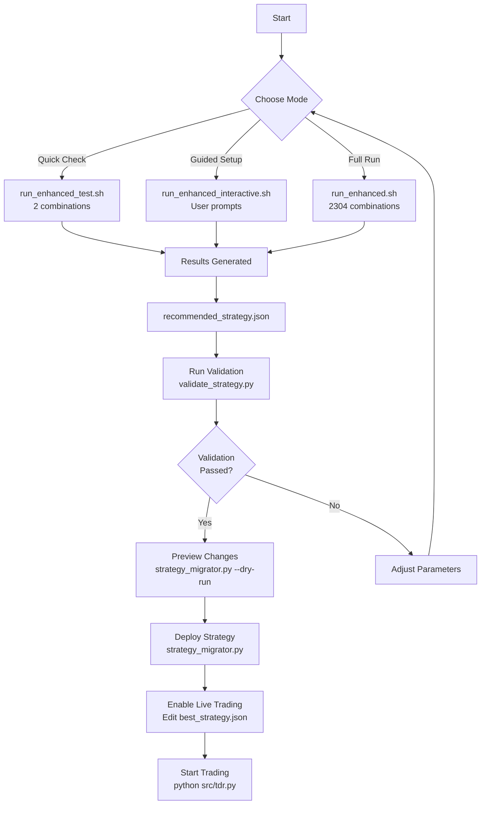

# Enhanced Backtesting Workflow

## 🔄 Standard Workflow



## 📊 Parameter Selection Flow

```
Interactive Mode Flow:
┌─────────────────────┐
│  Select Date Range  │
├─────────────────────┤
│ 1. Last 30 days     │
│ 2. Last 60 days     │
│ 3. Last 120 days    │
│ 4. Last 180 days    │
│ 5. Custom range     │
└─────────────────────┘
           ↓
┌─────────────────────┐
│ Select Optimization │
├─────────────────────┤
│ 1. Quick (2)        │
│ 2. Conservative(64) │
│ 3. Moderate (216)   │
│ 4. Thorough (2304)  │
│ 5. Aggressive(12K)  │
│ 6. Custom           │
└─────────────────────┘
           ↓
    [If Custom]
           ↓
┌─────────────────────┐
│  Define Parameters  │
├─────────────────────┤
│ • Short MA windows  │
│ • Long MA windows   │
│ • Regime threshold  │
│ • Confirmation bars │
│ • Trade gap minutes │
│ • Whipsaw threshold │
└─────────────────────┘
```

## 🎯 Decision Tree

```
Which Mode Should I Use?

Is this your first time?
    YES → Use Interactive Mode (--user-prompts)
    NO ↓

Do you need results quickly?
    YES → Use Test Run (--test-run)
    NO ↓

Are you doing daily optimization?
    YES → Use Conservative (--optimization-preset conservative)
    NO ↓

Are you doing weekly optimization?
    YES → Use Moderate (--optimization-preset moderate)
    NO ↓

Do you have time for deep analysis?
    YES → Use Aggressive (--optimization-preset aggressive)
    NO → Use Standard (run_enhanced.sh)
```

## 📈 Performance vs Time Trade-off

```
Combinations    Time        Accuracy    Use Case
━━━━━━━━━━━━━━━━━━━━━━━━━━━━━━━━━━━━━━━━━━━━━━
2              1 min       Low         Quick test
64             5-10 min    Good        Daily check
216            30-60 min   Better      Weekly optimization
2,304          2-4 hours   Best        Standard run
12,500         8-12 hours  Exhaustive  Monthly analysis
```

## 🔍 Results Analysis Flow

```
1. Check recommended_strategy.json
   └─> Total Return > 0%?
       └─> Sharpe Ratio > 0.5?
           └─> Max Drawdown < 20%?
               └─> Win Rate > 50%?
                   └─> GOOD TO DEPLOY

2. If any metric fails:
   └─> Check adaptive_strategy_optimization.csv
       └─> Find next best parameters
           └─> Or adjust constraints in config.json

3. Compare regime performance:
   └─> Which market type performs best?
       └─> Adjust parameters accordingly
```

## 🚀 Deployment Checklist

- [ ] Backtesting complete
- [ ] Validation passed
- [ ] Results reviewed
- [ ] Changes previewed
- [ ] Strategy deployed
- [ ] best_strategy.json backed up
- [ ] Live trading enabled
- [ ] Initial trades monitored

## 💡 Tips for Each Stage

### During Optimization
- Monitor progress messages
- Check system resources
- Be patient with large runs

### After Results
- Compare multiple time periods
- Look at regime performance
- Check trade frequency

### Before Deployment
- Always validate first
- Preview changes
- Start with paper trading

### After Deployment
- Monitor first 24 hours
- Check trade execution
- Compare with backtest